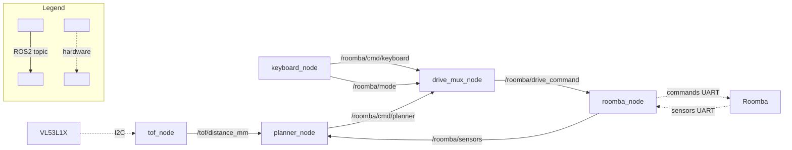

# roomba-ros2-work

ROS2 / C++ / Bazel-based control system for iRobot Roomba 600 series,
running on Raspberry Pi 5 via serial (UART) using the
[Roomba Open Interface (OI)](https://edu.irobot.com/learning-library/roomba-open-interface) protocol.

The primary goal is hands-on experience with ROS2, C++17, and Bazel for hardware control —
not to build a production cleaning robot.

---

## Prerequisites

**Hardware**

| Item | Detail |
|---|---|
| Robot | iRobot Roomba 692 or 643 |
| Computer | Raspberry Pi 5 |
| Serial cable | USB-to-serial (USB-FTDI) cable to Roomba Mini-DIN 7-pin connector |
| Distance sensor | VL53L1X ToF sensor (I2C, for wall-following mode) |

**Software**

| Item | Detail |
|---|---|
| OS | Ubuntu 24.04 |
| ROS2 | Jazzy |
| Build | [Bazel 8.4.1](https://bazel.build/) (bzlmod) |
| Toolchain | clang-format + clang-tidy (LLVM 18): `sudo apt install clang-format clang-tidy` |

---

## Quick Start

No hardware required — the stub mode simulates serial and sensor I/O.

```bash
# 1. Build
bazel build //...

# 2. Terminal 1: launch all infrastructure nodes (stub mode)
bazel run //launch:roomba_bringup_stub

# 3. Terminal 2: keyboard control
bazel run //keyboard_node:keyboard_node
```

**Keyboard controls**

| Key | Action |
|---|---|
| `w` / `s` | Forward / Backward |
| `a` / `d` | Spin left / Spin right |
| `Space` | Stop |
| `Tab` | Toggle MANUAL / WALL_FOLLOW mode |
| `q` | Quit |

Auto-stop fires after 500 ms of no input.
In WALL_FOLLOW mode, drive keys are ignored; press `Tab` again to return to MANUAL.

**Where to go next**

- Real hardware: see [Hardware Setup](#hardware-setup)
- Foxglove visualization, camera, bag recording: see [docs/runbook.md](docs/runbook.md)
- Static analysis: `bazel build //... --config clang-tidy`
- Unit tests: `bazel test //...`

---

## Topic Architecture

<!-- Generated by: python3 scripts/gen_topic_graph.py --exclude monitor_node -->


`drive_mux_node` forwards either the keyboard command or the planner command to `roomba_node`
based on the current `/roomba/mode` (MANUAL=0 / WALL_FOLLOW=1 / FOLLOW_ROOMBA=2).
Mode is toggled from `keyboard_node` via the `Tab` key.

> `monitor_node` and `foxglove_bridge` also subscribe to `/roomba/sensors` — omitted for clarity.

---

## Project Layout

| Path | What it is | How to use |
|---|---|---|
| `*_node/` | One directory per ROS2 node | `bazel run //<name>_node:<name>_node` |
| `launch/` | Launch files that start node groups and load `config/roomba_params.yaml` | `bazel run //launch:roomba_bringup[_stub]` |
| `scripts/` | Helper scripts for processes that must run **outside Bazel** (foxglove_bridge, camera, bag recording) | `./scripts/<name>.sh` directly |
| `tools/` | clang-format scripts invoked by Bazel — not run directly | `bazel run //:format`, `bazel test //:format_check` |
| `libroomba/` | ROS2-independent core library: serial HAL, OI protocol, wall-following algorithm | `bazel test //libroomba/tests/...` |
| `roomba_msgs/` | Custom ROS2 message definitions (DriveCommand, RoombaSensors, DriveMode) | built automatically |
| `config/` | YAML parameter file for all nodes | loaded by launch files |
| `docs/runbook.md` | Full session procedures: Foxglove, camera, recording, replay | read directly |

---

## Style & Guide

C++ code follows the [Google C++ Style Guide](https://google.github.io/styleguide/cppguide.html).
clang-format and clang-tidy enforce the rules automatically.

```bash
bazel run //:format                  # apply clang-format
bazel test //:format_check           # check formatting (also runs in bazel test //...)
bazel build //... --config clang-tidy  # static analysis
```

File extensions are `.cpp` (implementation) and `.hpp` (headers).
This differs from the reference implementation `togikaidrive-ros2` which uses `.cc`/`.h`.

### Practices not caught by the tools

The following must be checked manually during code review:

**Brace initialization** — Always use `{}`, never `= value`:

```cpp
int32_t count{0};        // good
int32_t count = 0;       // bad
```

**Fixed-width integer types** — Use `int32_t`, `uint8_t`, `int16_t`, etc. instead of `int`.
Exception: POSIX file descriptors (`int fd_`) follow the POSIX convention.

### clang-tidy suppressions

Three rules are suppressed globally in `.clang-tidy` because they conflict with this codebase's constraints:

| Suppressed rule | Reason |
|---|---|
| `cppcoreguidelines-avoid-magic-numbers` | Config struct default values would all require named constants — impractical |
| `cppcoreguidelines-pro-type-vararg` | POSIX terminal I/O (`printf`) is required |
| `bugprone-easily-swappable-parameters` | OI-spec API pairs (e.g. `left_mm_s, right_mm_s`) cannot be reordered |

For localized violations forced by POSIX APIs, suppress inline with a reason:

```cpp
// NOLINTNEXTLINE(cppcoreguidelines-pro-bounds-pointer-arithmetic): POSIX read() requires raw pointer offset
ssize_t n{read(fd_, buf + total, len - total)};
```

---

## Conventions & Decisions

### Adding a new node

1. Create `<name>_node/<name>_node.cpp` and `<name>_node/BUILD.bazel`
2. Add to `launch/roomba_bringup.py` (and `roomba_bringup_stub.py` if stub mode is supported)
3. Add a parameter section to `config/roomba_params.yaml`
4. Update the topic diagram in this README

### Why `scripts/` processes must run outside Bazel

`foxglove_bridge`, `v4l2_camera`, and `ros2 bag` are installed via apt.
Bazel overrides `AMENT_PREFIX_PATH` when launching nodes, which prevents apt-installed
packages from finding their ROS2 typesupport libraries.
Running these in a separate terminal (via `scripts/`) avoids this conflict.
DDS operates at the network level, so Bazel-launched nodes and script-launched nodes
discover each other's topics automatically.

### Why colcon build is required for `ros2 topic echo` and `foxglove_bridge`

Both tools resolve custom message types through the ROS2 workspace install path.
Bazel's generated setup does not provide this. Build `roomba_msgs` once with colcon:

```bash
mkdir -p ~/ros2_ws/src && cp -r roomba_msgs ~/ros2_ws/src/
cd ~/ros2_ws && colcon build --packages-select roomba_msgs
source ~/ros2_ws/install/setup.bash  # add to ~/.bashrc
```

---

## Hardware Setup

### Serial connection (Roomba)

The Roomba 600 series exposes a 7-pin Mini-DIN connector.
Connect via a USB-to-serial (USB-FTDI) cable; the device appears as `/dev/ttyUSB0`.

```bash
sudo usermod -a -G dialout $USER   # re-login after
```

Update `config/roomba_params.yaml`:

```yaml
roomba_node:
  ros__parameters:
    serial_port: "/dev/ttyUSB0"
```

### I2C connection (VL53L1X ToF sensor)

Connect the sensor to the Raspberry Pi I2C bus (`/dev/i2c-1`, address 0x29).
On Ubuntu (not Raspberry Pi OS), enable I2C if not already active:

```bash
# Only needed if /dev/i2c-1 does not exist
echo "dtparam=i2c_arm=on" | sudo tee -a /boot/firmware/config.txt && sudo reboot
```

```bash
sudo usermod -aG i2c $USER   # re-login after
i2cdetect -y 1               # 0x29 should appear
```
